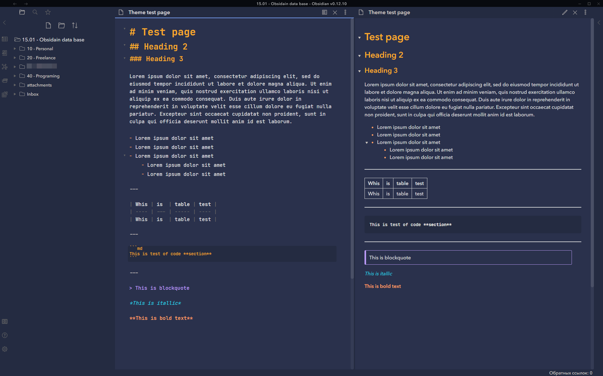

# Tokyo Night Obsidian Theme
A dark theme for [Obsidian](https://obsidian.md/)


## Install
1. Download obsidian.css to your Obsidian vault folder.
2. In Obsidian, click ```Settings->Plugins``` and turn on "Custom CSS".
3. There is no step 3! Enjoy!

## License
I don't really care what happens to this theme, so I put it under [The Unlicense](./LICENSE) and set it free!

## Version

22/07/2021 - Rev. 2.0 - All been updated now
